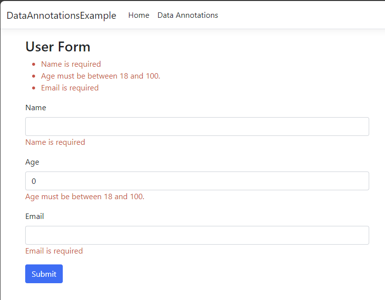

# Easy Form Validation with Data Annotations
Form validation is a crucial aspect of any application that collects user input. It ensures that the data entered by users meets specific criteria, helping to maintain data integrity and improve the user experience.

In .NET, **data annotations** provide a simple and effective way to enforce validation rules on model class properties. This repository demonstrates how to use data annotations for form validation in an **ASP.NET Core MVC** application.  

<br>

## Application Screenshot


<br>

## **Technologies Used**  
- .NET 8  
- ASP.NET Core MVC  
- Visual Studio 2022  

<br>

## Installation Instructions
To get this project up and running, follow these steps:

### Prerequistes

- .NET SDK version 8 or higher should be installed. If you don't have it, you can download from https://dotnet.microsoft.com/en-us/download.
- Visual Studio 2022 (or later) is recommended. You can download the free Community version at https://visualstudio.microsoft.com/vs/community/.

If you have Visual Studio 2022, the .NET SDK is likely be installed. You can verify you have the correct version by running the following in a command prompt:

```
dotnet --version
```

### Installation

1. Clone the repository:
```
git clone https://github.com/rogerjes/DataAnnotations
cd DataAnnotations
```

2. Open the solution in Visual Studio 2022. 

3. Run the application and select Data Annotation in the menu at the top to see the form validation in action.

<br>

## Contributing to this project
This repository is intended to be a skills development project and is read-only. Your ideas and suggestions are welcome at [Discussions](https://github.com/rogerjes/DataAnnotations/discussions/1)

<br>

## License
This project is open-source and available under the [MIT License](https://opensource.org/licenses/MIT).
